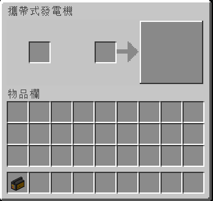

# ⚡ Copy of 空調

.png>)

充電板是一種[通電機器](../space/energy-systems.md)，站在上面時可為玩家背包中的通電物品充電。

這比[充電站](Charging-Station.md)慢，但比[無線充電站](Wireless-Charging-Station.md)快

## 獲得

### 製作

充電板可以使用以下物品製作：

* 1 [電池](Battery.md)
* 1 [電容](Capacitor.md)​
* 1 [電路板](Circuit-Board.md)
* 2 [鋁棒](Aluminium-Rod.md)
* 2 [防突波電線](Surge-Proof-Wire.md)
* 2 [鈦粉](Titanium-Dust.md)

## 用法

### 啟動

充電板可以通過[導管](Conduit.md)接收能量。

一個充電板可以儲存多達 5000 單位的能量。

### 充電

在為其提供能量的同時，充電板將為站在其上方玩家背包中的任何帶電物品充電。
