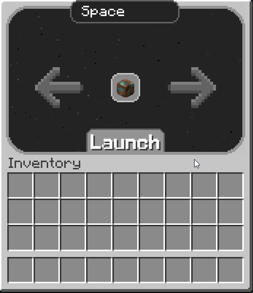

# 🚁 火箭

 (1) (1) (1).png>)

火箭是太空中的主要交通方式，因為它便於攜帶，可以快速輕鬆地前往其他地方。只需要燃料就可以無限重複使用。但有機率發射失敗(會爆炸)

### 用法

當你第一次旅行到一個新星球時，你會傳送到那個星球的出生地。然而，你可以出去探索任何你喜歡的地方，然後用你的火箭返回地球。

1. 通過右鍵放置您的火箭。
2. 按住 **Shift + 右鍵** 點擊火箭加油，根據距離的不同需要的[燃料](fuel-bucket.md)也不同。
3. 右鍵點擊火箭打開界面，並坐在裡面準備發射。
4. 選擇你想傳送到的星球。
5. 在整個倒數計時期間坐在火箭中（不要離開它），然後直到它達到最高高度。
6. 然後你會傳送到你的目的地
7. 盡情探索銀河吧！

### 製作

火箭可以使用以下物品製作：

.png>)

* 1 [電路板](Circuit-Board.md)
* 1 [強化鋁合金錠](reinforced-aluminium-alloy-ingot.md)
* 1 [鈦罐](Titanium-Can.md)
* 2 [電容](Capacitor.md)
* 2 [鈀錠](palladium-ingot.md)
* 2 [防突波電線](Surge-Proof-Wire.md)

### 加油

要為火箭提供燃料，您只需要：

* Shift + 右鍵點擊火箭打開加油畫面
* 放入[燃料桶](fuel-bucket.md)，直到您有足夠的燃料可以前往目的地

<figure><figcaption></figcaption></figure>
